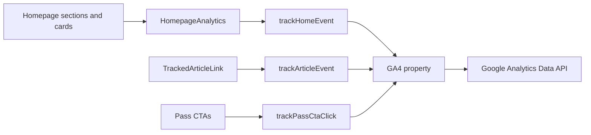

# Homepage Engagement Tracking

This document describes the GA4 engagement tracking for `/`. It complements
`guideEngagement.md` and uses the same anonymous, qualified-exposure model.

## Goals

The tracking answers these questions:

- How far through the homepage do visitors reach?
- Which editorial, guide, event, wellness, and utility cards earn attention?
- Which content has the strongest click-through rate after qualified exposure?
- Which homepage placements generate Pass interest?
- How often does the homepage generate transport enquiries and newsletter signups?
- How do results differ by device and acquisition channel?

Do not send email addresses, names, pass identifiers, or other personal data to
GA4.

## Architecture



Relevant files:

- `src/analytics.js`: homepage, article, Pass, and page-view transports
- `src/components/analytics/HomepageAnalytics.jsx`: qualified visibility and delegated interactions
- `src/components/ui/TrackedArticleLink.jsx`: article card impressions and selections
- `src/components/newsletter/NewsletterSignup.jsx`: anonymous signup success
- `src/pages/Home.jsx`: stable section, content, position, and control metadata

## Qualified Exposure

A section marker or content card must be at least 50% visible for one continuous
second. Leaving before the threshold cancels the pending impression.

Each section is emitted once per homepage render. Content impressions are
deduplicated by section, content ID, and position. This also prevents the three
copies used by the looping Weekly Picks rail from inflating exposure.

Cards inserted after the events API responds are discovered through a mutation
observer and use the same visibility rules.

## Events

| Event | Trigger | Important parameters |
| --- | --- | --- |
| `home_section_view` | Qualified section-heading exposure | `home_section`, `component_location` |
| `home_content_impression` | Qualified non-article card exposure | content fields, `home_section`, `position` |
| `home_content_select` | Internal non-article card or CTA selected | content fields, `home_section`, `position`, `destination_url` |
| `home_outbound_click` | External homepage content selected | content fields, `link_type`, `destination_url` |
| `home_control_select` | A meaningful homepage control is selected | `control_name`, `home_section` |
| `newsletter_signup_success` | Homepage newsletter subscriber creation succeeds | `home_section`, `component_location` |
| `article_card_impression` | Qualified Editor's Picks or Weekly Picks exposure | article fields, `component_location`, `position` |
| `article_select` | Editor's Picks or Weekly Picks article selected | article fields, `component_location`, `position` |
| `pass_cta_click` | Pass CTA selected | `cta_location`, `destination_url` |

Content fields are:

- `content_id`: stable route, category key, or source record identity
- `content_title`: display-name snapshot
- `content_type`: event, guide, utility link, category, enquiry, or other content class

Use `home_*` events for homepage reporting rather than generic Enhanced
Measurement clicks. Combining both can double-count outbound actions.

## GA4 Custom Dimensions

Register these event-scoped custom dimensions before querying breakdowns:

| Dimension name | Event parameter |
| --- | --- |
| Homepage section | `home_section` |
| Component location | `component_location` |
| Content ID | `content_id` |
| Content title | `content_title` |
| Content type | `content_type` |
| Position | `position` |
| Destination URL | `destination_url` |
| Link type | `link_type` |
| Control name | `control_name` |
| CTA location | `cta_location` |
| Page type | `page_type` |

Custom definitions are not retroactive. Built-in dimensions such as
`eventName`, `pagePath`, `deviceCategory`, and `sessionDefaultChannelGroup` do
not need registration.

## Core Reports

Use a four-week window because homepage content changes weekly. Always segment
the baseline by device category and acquisition channel.

Section reach:

$$
\text{Section reach} =
\frac{\text{users with home\_section\_view}}{\text{homepage users}}
$$

Content click-through rate:

$$
\text{Content CTR} =
\frac{\text{home\_content\_select users}}{\text{home\_content\_impression users}}
$$

Also report:

- article CTR by `component_location`, `content_id`, and `position`
- Pass CTA users divided by homepage users, broken down by `cta_location`
- transport WhatsApp outbound users divided by transport section viewers
- newsletter success users divided by homepage users
- downstream Pass purchases segmented by homepage acquisition and CTA attribution

Do not compare raw selection counts across sections without using qualified
impressions or section reach as the denominator.

## Data API Access

The numeric GA4 property ID is configured locally, but reports also require
Google Application Default Credentials or a service account with Viewer access
to the property. Keep credentials outside the repository.

```sh
export GOOGLE_APPLICATION_CREDENTIALS="/absolute/path/to/service-account.json"
```

After authentication, query `pagePath` exactly `/` and use
`customEvent:<parameter>` for registered custom dimensions, for example
`customEvent:home_section`.

## Operational Notes

- Validate new events in GA4 DebugView before relying on standard reports.
- Allow processing time before querying the Data API.
- Keep event names and parameter keys stable to preserve historical reports.
- Confirm the Google Ads page-view conversion is secondary rather than a primary bidding goal.
- Verify cross-domain measurement between `ahangama.com` and `pass.ahangama.com` before attributing purchases.