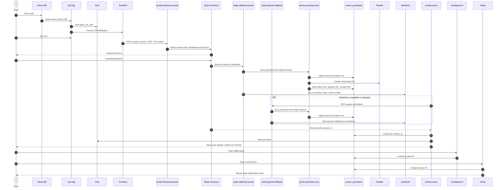

# Ahangama Pass Workflow

This document explains the full promo pass workflow from QR scan to purchase, fulfillment, analytics, and pass verification.

## What This Document Covers

This workflow includes:

- scanning a venue QR code
- loading a dynamic promo landing page
- sending the user into Stripe Checkout with backend-controlled pricing
- persisting purchase and attribution data in the promo database
- generating the digital pass and PassKit smart link
- sending confirmation and operational emails
- tracking CTA and purchase analytics with UTM propagation
- resolving the pass on success, pass, and verify pages

## High-Level Architecture

There are two separate databases in this project and they must stay separate:

- `DATABASE_URL`: venue content and venue metadata
- `NETLIFY_DATABASE_URL`: promo purchase records and pass fulfillment data

Key runtime layers:

- React + Vite frontend
- Netlify Functions for checkout, verification, webhooks, and lookup APIs
- Stripe Checkout for payment
- Neon Postgres for promo purchase storage
- PassKit SmartPass for Apple Wallet delivery
- SendGrid for email delivery
- GA4 for CTA and purchase tracking

## Sequence Diagram



## Main User Journey

### 1. Scan a QR code

The user scans a venue QR code that points to a route like:

- `/qr/:slug`

Primary page:

- [src/pages/VenueQrLandingPage.jsx](/Users/viji/DevEnv/ahangama-app/src/pages/VenueQrLandingPage.jsx)

Promo definitions:

- [src/data/prPromotions.js](/Users/viji/DevEnv/ahangama-app/src/data/prPromotions.js)

What happens here:

- the venue slug selects a promo configuration
- the UI renders a mobile-first receipt-style promo page
- promo copy, included items, promo code, and final price are dynamic per venue
- the page carries QR attribution in the URL using values such as `utm_source=qr`, `utm_medium=offline`, and `utm_content=<venue-slug>`

### 2. User taps the promo CTA

The CTA on the QR landing page sends the user into the pass purchase flow.

Tracking entry points:

- [src/analytics.js](/Users/viji/DevEnv/ahangama-app/src/analytics.js)
- [src/lib/passAttribution.js](/Users/viji/DevEnv/ahangama-app/src/lib/passAttribution.js)

What is recorded client-side:

- CTA location
- current page path
- source domain
- UTM fields

Important GA4 events:

- `pass_cta_click`
- `purchase`

Attribution behavior:

- UTM params are read from the current URL
- attribution is persisted in `localStorage`
- canonical QR attribution can overwrite older stored attribution
- the same attribution is forwarded into Stripe Checkout creation

### 3. Checkout session is created

Frontend service:

- [src/services/stripe.js](/Users/viji/DevEnv/ahangama-app/src/services/stripe.js)

Backend function:

- [netlify/functions/create-checkout-session.js](/Users/viji/DevEnv/ahangama-app/netlify/functions/create-checkout-session.js)

Important behavior:

- the frontend sends `productId`, customer details, promo context, CTA location, and attribution
- success and cancel URLs keep the current query params intact
- the frontend uses a placeholder session token and converts it to Stripe’s `{CHECKOUT_SESSION_ID}` format before the request is sent
- promo pricing is controlled on the backend, not trusted from the client

For promo flows the server:

- validates the venue slug and promo code using [src/data/prPromotions.js](/Users/viji/DevEnv/ahangama-app/src/data/prPromotions.js)
- calculates the retail bundle value and promo price
- creates a one-time Stripe coupon if needed so Stripe shows subtotal, discount, and final charged price correctly
- uses `Value Bundle` as the Stripe product name for promo sales
- forces promo validity to 30 days

Metadata stored on the Stripe Checkout session includes:

- `flowType`
- `ctaLocation`
- `venueSlug`
- `promoCode`
- `utmSource`
- `utmMedium`
- `utmCampaign`
- `utmContent`
- `utmTerm`
- `productName`
- `productDescription`
- `listPriceUsd`
- `chargedPriceUsd`
- `discountUsd`
- `validityDays`
- `maxPeople`
- `startDate`

### 4. Stripe payment completes

Two backend paths can finalize promo fulfillment:

- preferred path: Stripe webhook
- fallback path: success-page verification call

Webhook handler:

- [netlify/functions/stripe-webhook-promo.js](/Users/viji/DevEnv/ahangama-app/netlify/functions/stripe-webhook-promo.js)

Fallback verification endpoint:

- [netlify/functions/verify-payment.js](/Users/viji/DevEnv/ahangama-app/netlify/functions/verify-payment.js)

This hybrid model exists because local development and webhook delivery are not always reliable during setup.

### 5. Promo purchase row is created or updated

Shared sync logic:

- [lib/promo-purchase-sync.js](/Users/viji/DevEnv/ahangama-app/lib/promo-purchase-sync.js)

Database access layer:

- [lib/promo-purchases-db.js](/Users/viji/DevEnv/ahangama-app/lib/promo-purchases-db.js)

Database schema:

- [migrations/001_create_promo_purchases.sql](/Users/viji/DevEnv/ahangama-app/migrations/001_create_promo_purchases.sql)

What the sync step does:

- builds a deterministic promo pass ID from the Stripe session ID
- creates a pass URL such as `/card/pass/AHG-...`
- computes start date and expiry date
- normalizes promo validity to 30 days
- resolves the Stripe receipt URL from the payment intent or latest charge
- generates a PassKit smart link when possible
- upserts the `promo_purchases` row in the promo database

Important data stored in `promo_purchases`:

- customer name, email, phone
- product and promo details
- CTA location
- UTM fields
- list price, discount, final charged price
- validity dates
- pass ID and pass URL
- PassKit pass ID and smart link
- email delivery statuses
- Stripe receipt URL

Important constraint:

- promo purchase storage must use `NETLIFY_DATABASE_URL`
- it must not silently fall back to `DATABASE_URL`

### 6. PassKit smart link is generated

PassKit integration:

- [lib/promo-passkit.js](/Users/viji/DevEnv/ahangama-app/lib/promo-passkit.js)

What it does:

- calls PassKit’s SmartPass API
- creates an Apple Wallet-compatible link when configuration is present
- stores the returned smart link on the promo purchase record
- sets the pass expiry using Colombo time formatting

The generated link is later used on the success page and returned from backend lookup endpoints.

### 7. Emails are sent

Fulfillment coordinator:

- [lib/promo-purchase-fulfillment.js](/Users/viji/DevEnv/ahangama-app/lib/promo-purchase-fulfillment.js)

Email templates and delivery:

- [lib/promo-purchase-emails.js](/Users/viji/DevEnv/ahangama-app/lib/promo-purchase-emails.js)

Current email outputs:

- customer confirmation email
- team notification email
- venue notification email

Current operational behavior:

- customer email includes the digital pass URL
- team email includes venue, CTA location, UTM summary, and Stripe session ID
- venue notification currently goes to hardcoded `hello@viji.com`
- email delivery statuses are stored on the promo purchase row
- already-sent statuses are preserved on later upserts

### 8. Success page resolves the purchase

Success page:

- [src/pages/PaymentSuccess.jsx](/Users/viji/DevEnv/ahangama-app/src/pages/PaymentSuccess.jsx)

Lookup endpoints used by the success page:

- [netlify/functions/promo-purchase-by-session.js](/Users/viji/DevEnv/ahangama-app/netlify/functions/promo-purchase-by-session.js)
- [netlify/functions/verify-payment.js](/Users/viji/DevEnv/ahangama-app/netlify/functions/verify-payment.js)

What the success page does:

- reads `session_id` from the URL
- guards against the raw placeholder value accidentally reaching the page
- waits briefly for the promo purchase row to exist
- uses the promo database record when available
- falls back to `verify-payment` if needed
- tracks the GA4 `purchase` event once per session
- prefers the PassKit smart link as the primary action
- can auto-redirect promo purchases to the PassKit URL once per session
- renders a QR code that points to `https://ahangama.com/verify?AHG-...`

### 9. Customer opens the pass

Pass page:

- [src/pages/CardPass.jsx](/Users/viji/DevEnv/ahangama-app/src/pages/CardPass.jsx)

Behavior:

- promo pass IDs with the `AHG-<12 hex chars>` shape are fetched from the promo backend
- older legacy passes still fall back to `localStorage`
- the pass page QR code points to the verify URL, not to a frontend-only token

### 10. Venue or user verifies the pass

Verification page:

- [src/pages/CardVerify.jsx](/Users/viji/DevEnv/ahangama-app/src/pages/CardVerify.jsx)

Promo pass lookup service:

- [src/services/stripe.js](/Users/viji/DevEnv/ahangama-app/src/services/stripe.js)

Promo pass lookup backend:

- [netlify/functions/promo-pass-by-id.js](/Users/viji/DevEnv/ahangama-app/netlify/functions/promo-pass-by-id.js)

Supported verification URL forms:

- `/verify?AHG-...`
- `/verify?qr=AHG-...`
- `/verify/:cardId`
- `/card/verify`
- `/card/verify/:cardId`

Current behavior for direct verify URLs:

- the page skips the generic landing state
- it auto-verifies immediately
- it renders the final result page directly
- the direct result view can show valid or invalid status without requiring a manual scan step

## Promo Routes and APIs

Frontend routes involved in the workflow:

- `/qr/:slug`
- `/card`
- `/card/success`
- `/card/pass/:cardId`
- `/card/verify`
- `/card/verify/:cardId`
- `/verify`
- `/verify/:cardId`

Primary Netlify functions:

- `/.netlify/functions/create-checkout-session`
- `/.netlify/functions/verify-payment`
- `/.netlify/functions/stripe-webhook-promo`
- `/.netlify/functions/promo-purchase-by-session`
- `/.netlify/functions/promo-pass-by-id`
- `/.netlify/functions/api-venues-list`

## Key Source Files

Promo landing and content:

- [src/pages/VenueQrLandingPage.jsx](/Users/viji/DevEnv/ahangama-app/src/pages/VenueQrLandingPage.jsx)
- [src/data/prPromotions.js](/Users/viji/DevEnv/ahangama-app/src/data/prPromotions.js)
- [src/lib/promoReceipt.js](/Users/viji/DevEnv/ahangama-app/src/lib/promoReceipt.js)

Checkout and verification:

- [src/services/stripe.js](/Users/viji/DevEnv/ahangama-app/src/services/stripe.js)
- [netlify/functions/create-checkout-session.js](/Users/viji/DevEnv/ahangama-app/netlify/functions/create-checkout-session.js)
- [netlify/functions/verify-payment.js](/Users/viji/DevEnv/ahangama-app/netlify/functions/verify-payment.js)

Promo persistence and fulfillment:

- [lib/promo-purchases-db.js](/Users/viji/DevEnv/ahangama-app/lib/promo-purchases-db.js)
- [lib/promo-purchase-sync.js](/Users/viji/DevEnv/ahangama-app/lib/promo-purchase-sync.js)
- [lib/promo-purchase-fulfillment.js](/Users/viji/DevEnv/ahangama-app/lib/promo-purchase-fulfillment.js)
- [lib/promo-purchase-emails.js](/Users/viji/DevEnv/ahangama-app/lib/promo-purchase-emails.js)
- [lib/promo-passkit.js](/Users/viji/DevEnv/ahangama-app/lib/promo-passkit.js)

Post-purchase UX:

- [src/pages/PaymentSuccess.jsx](/Users/viji/DevEnv/ahangama-app/src/pages/PaymentSuccess.jsx)
- [src/pages/CardPass.jsx](/Users/viji/DevEnv/ahangama-app/src/pages/CardPass.jsx)
- [src/pages/CardVerify.jsx](/Users/viji/DevEnv/ahangama-app/src/pages/CardVerify.jsx)

Analytics and attribution:

- [src/analytics.js](/Users/viji/DevEnv/ahangama-app/src/analytics.js)
- [src/lib/passAttribution.js](/Users/viji/DevEnv/ahangama-app/src/lib/passAttribution.js)

Venue content:

- [lib/venues-db.js](/Users/viji/DevEnv/ahangama-app/lib/venues-db.js)

## Environment Variables

Do not commit real secrets. Configure these in local `.env` and in Netlify site settings.

### Core frontend / app

- `VITE_SITE_URL`
- `NODE_ENV`

### Venue content database

- `DATABASE_URL`

Used for:

- venue data
- venue lookup
- partner and content functions

### Promo purchase database

- `NETLIFY_DATABASE_URL`
- `NETLIFY_DATABASE_URL_UNPOOLED` if you need a direct connection for manual administration

Used for:

- `promo_purchases`
- promo session lookup
- promo pass lookup
- fulfillment status tracking

### Stripe

- `STRIPE_SECRET_KEY`
- `STRIPE_SECRET_KEY_LIVE`
- `STRIPE_WEBHOOK_SECRET`

Stripe key selection is handled by:

- [lib/stripe-config.js](/Users/viji/DevEnv/ahangama-app/lib/stripe-config.js)

### PassKit

- `PASSKIT_DISTRIBUTION_URL`
- `PASSKIT_SMARTPASS_SECRET`

### Email

- `SENDGRID_API_KEY`

### Optional legacy / other integrations still present in the repo

- Gmail variables for older email flows
- other support keys used outside the promo pass flow

## Database Setup

The promo pass flow requires the `promo_purchases` table in the promo database.

Migration file:

- [migrations/001_create_promo_purchases.sql](/Users/viji/DevEnv/ahangama-app/migrations/001_create_promo_purchases.sql)

Apply it against `NETLIFY_DATABASE_URL`, not against `DATABASE_URL`.

If the migration is missing in production, direct pass verification will fail with errors such as:

- `relation "promo_purchases" does not exist`

## Local Development

Install dependencies:

```bash
npm install
```

Run the local Netlify dev environment so frontend routes and functions share the same origin:

```bash
ntl dev --port 8890
```

Typical local URLs:

- app and functions through Netlify dev: `http://localhost:8890`
- Vite-only dev target behind Netlify dev: `http://localhost:5173`

Important local setup steps:

- configure both `DATABASE_URL` and `NETLIFY_DATABASE_URL`
- apply the promo migration to the promo database
- configure Stripe keys
- configure SendGrid if you want email delivery to work locally
- configure PassKit if you want smart links to be generated locally

## Operational Notes

### Promo validity

- promo purchases are normalized to 30 days
- this is enforced server-side

### Product naming

- promo checkout uses `Value Bundle` as the Stripe-visible product name

### Receipt URL storage

- Stripe receipt URLs are resolved from the payment intent or latest charge
- the URL is persisted on the promo purchase row

### Legacy pass flow

- some legacy localStorage-based pass logic still exists for older non-promo passes
- promo flows should use the promo database-backed path

### Venue notifications

- current venue notification email target is hardcoded to `hello@viji.com`

## Known Failure Modes

### Hosted verify page shows loading or fails

Check:

- `promo_purchases` exists in the database pointed to by `NETLIFY_DATABASE_URL`
- production functions have `NETLIFY_DATABASE_URL` set
- production functions are not accidentally reading from `DATABASE_URL` for promo purchase lookups

### Success page shows an invalid session error

Check:

- the success URL includes a real Stripe session ID
- `{CHECKOUT_SESSION_ID}` was not left unexpanded in the browser URL

### Promo purchase not found

Check:

- webhook delivery
- fallback verification path
- whether the row exists in `promo_purchases`

### PassKit link is empty

Check:

- `PASSKIT_DISTRIBUTION_URL`
- `PASSKIT_SMARTPASS_SECRET`
- whether the purchase has a valid expiry date

### Emails are missing

Check:

- `SENDGRID_API_KEY`
- promo purchase email status columns
- Netlify function logs for SendGrid errors

## Short Sequence Summary

1. User scans venue QR and opens `/qr/:slug`.
2. Promo landing page loads dynamic receipt content from `prPromotions`.
3. CTA click is tracked and current UTM attribution is persisted.
4. Frontend requests `create-checkout-session` with promo context and attribution.
5. Backend validates promo context and creates a Stripe Checkout session with promo metadata.
6. User pays in Stripe.
7. Webhook or fallback verification syncs the paid Stripe session into `promo_purchases`.
8. Sync step generates pass ID, pass URL, expiry date, receipt URL, and PassKit smart link.
9. Fulfillment sends customer, team, and venue emails and updates statuses.
10. Success page resolves the purchase, tracks the GA4 purchase event, and can redirect to PassKit.
11. Pass and verify pages resolve the pass by promo pass ID and show the final pass state.

## Related Docs

- [STRIPE_ENVIRONMENTS.md](/Users/viji/DevEnv/ahangama-app/STRIPE_ENVIRONMENTS.md)